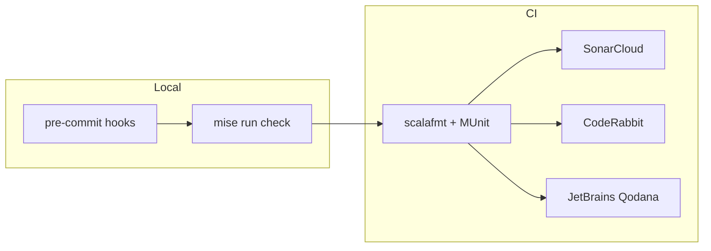

The Dice Chess Engine uses [CodeRabbit](https://coderabbit.ai) for automated pull request reviews. CodeRabbit analyzes every PR against `main` and provides inline feedback on correctness, performance, and style — with domain-specific awareness of our chess engine architecture.

---

## Quality Toolchain Overview

CodeRabbit is one layer in a multi-stage quality pipeline:



| Layer | Tool | Purpose |
| :--- | :--- | :--- |
| Pre-commit | `gitleaks` | Intercept leaked secrets before they reach Git history |
| Pre-commit | `pre-commit-hooks` | Trailing whitespace, YAML syntax, merge conflicts |
| CI | `scalafmt` | Enforce consistent Scala code formatting |
| CI | `MUnit` + `scoverage` | Unit tests with coverage reporting |
| CI | **CodeRabbit** | AI-powered PR review with domain-specific instructions |
| CI | SonarCloud | Static analysis: code smells, vulnerabilities, coverage metrics |
| CI | Qodana | JetBrains deep code inspection |

---

## Configuration

All CodeRabbit settings live in [`.coderabbit.yaml`](https://github.com/rabestro/dicechess-engine-scala/blob/main/.coderabbit.yaml) at the repository root. The file uses the [v2 schema](https://coderabbit.ai/integrations/schema.v2.json) and is version-controlled alongside the codebase.

### Review Profile

The review profile is set to **assertive**, which provides rigorous, performance-oriented feedback — appropriate for a chess engine where micro-optimization and bitwise correctness are critical.

### Disabled Features

| Feature | Reason |
| :--- | :--- |
| `high_level_summary` | Adds noise to PR threads without actionable value |
| `poem` | Decorative; distracting in a technical engine project |
| `eslint` | No hand-written JavaScript — all JS is machine-generated by Scala.js |
| `biome` | No JS/TS source code to format or lint |

### Enabled Tools

| Tool | What It Checks |
| :--- | :--- |
| `actionlint` | Validates GitHub Actions workflow YAML syntax and expressions |
| `gitleaks` | Detects leaked secrets (complements the pre-commit hook) |
| `shellcheck` | Lints shell scripts embedded in `mise.toml` and CI workflows |
| `markdownlint` | Validates documentation and README markdown formatting |

### Path Filters

Build artifacts, generated files, and vendored dependencies are excluded from review to reduce noise:

```yaml
path_filters:
  - "!**/target/**"           # SBT build output
  - "!**/project/target/**"   # SBT meta-build output
  - "!dist/**"                # NPM package distribution
  - "!**/*.lock"              # Lock files
  - "!**/package-lock.json"   # NPM lock file
  - "!docs/public/**"         # Static assets
```

---

## Domain-Specific Review Instructions

CodeRabbit supports **path-based review instructions** — targeted guidance that activates only when a PR touches specific directories. This gives the AI reviewer domain knowledge about our engine architecture.

### Configured Paths

| Path Pattern | Review Focus |
| :--- | :--- |
| `shared/**/domain/**` | Opaque type contracts, zero-cost abstraction, bitwise correctness |
| `shared/**/movegen/**` | Magic Bitboards, GC-free hot paths, Dice Chess rule enforcement |
| `shared/src/test/**` | Test DSL usage, edge case coverage, JSON fixture validity |
| `.github/workflows/**` | Pinned action SHAs, consistent Java/Node versions, mise task usage |
| `docs/**` | Starlight frontmatter, Mermaid syntax, internal link integrity |
| `build.sbt` | Cross-compilation consistency, plugin configuration |

### Example: Move Generation Instructions

When a PR modifies files under `shared/**/movegen/**`, CodeRabbit receives these instructions:

> *Prioritize correctness of bitwise shift/mask operations. Flag any heap
> allocations in hot paths. Verify Magic Bitboard lookup tables are indexed
> correctly. Check that Dice Chess rules are applied: max 3 micro-moves per
> turn, maximal micro-move count enforcement, and correct piece filtering by
> dice roll value.*

This ensures the AI reviewer focuses on engine-specific concerns rather than generic code style.

---

## Interacting with CodeRabbit

On any PR, you can use comment commands to interact with CodeRabbit:

| Command | Effect |
| :--- | :--- |
| `@coderabbitai review` | Trigger a full re-review of the PR |
| `@coderabbitai resolve` | Mark all CodeRabbit comments as resolved |
| `@coderabbitai configuration` | Display the current effective configuration |
| `@coderabbitai help` | List all available commands |
