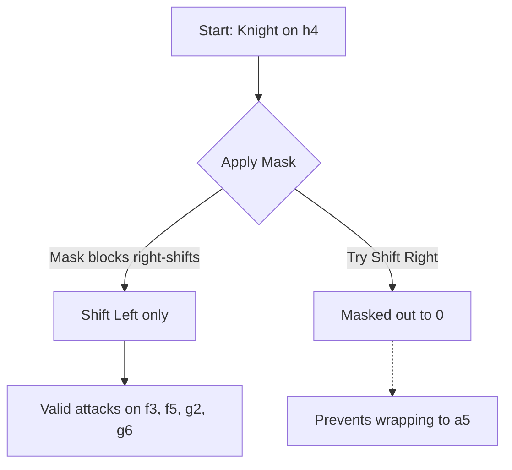

Move generation is the beating heart of any chess engine. In our Dice Chess engine, we generate millions of pseudo-legal and legal moves per second during deep Expectimax searches. To achieve maximum performance, we strictly avoid object allocations (Zero-GC) and rely heavily on Bitboard arithmetic.

---

## 1. Zero-GC Move Encoding

In Java/Scala, creating a `new Move(from, to)` object millions of times per second would overwhelm the Garbage Collector, causing massive lag spikes during the search.

To solve this, we encode every possible chess move into a **single 16-bit integer**, wrapped in a Scala 3 `opaque type` for type safety.

```scala
opaque type Move = Int
```

### Memory Layout
We pack the source square, destination square, and special flags into 16 bits:

| Bits 12-15 (4 bits) | Bits 6-11 (6 bits) | Bits 0-5 (6 bits) |
| :---: | :---: | :---: |
| **Flags** (Capture, Promotion) | **From** Square (0-63) | **To** Square (0-63) |

By extracting data via bitwise masks (`move & 0x3f`), we get instantaneous access to move properties without ever instantiating an object on the heap.

---

## 2. Leaper Attacks (Kings & Knights)

"Leaping" pieces are unique: their attacks are never blocked by other pieces. A Knight on `e4` always attacks the same 8 squares, regardless of what surrounds it.

Because of this, we calculate all Knight and King attacks **once at JVM startup** and store them in a static array. 

### The `O(1)` Array Lookup
When the engine needs to find Knight moves, it simply reads from the precomputed array:

```scala
val knightAttacks: Array[Bitboard] = Array.tabulate(64)(computeKnightAttacks)

// Instant O(1) lookup during search:
val attacks = knightAttacks(Square.index(sq))
```

### The Wrap-Around Bug
When generating the attack tables via Bitboard shifts, we run into a classic mathematical problem: **Wrap-around bugs**. 

Because a Bitboard is just a 64-bit sequence, shifting a Knight on the `H-file` (the right edge) to the right will mathematically overflow into the `A-file` (the left edge) on the next rank!

To prevent this, we apply **Not-File Masks** before shifting.



#### Example Mask (Not A-File)
If we want to shift a piece to the left, we first `AND` it with the `NotAFile` mask to ensure it's not already on the left edge.
```scala
val NotAFile: Bitboard = Bitboard(0xfefefefefefefefeL)
val nnw = (b & NotAFile) << 15 // Up 2, Left 1
```

---

## What's Next?
Following the leaper attacks, the engine architecture scales to handle **Pawn Generation** via parallel array shifts, and **Magic Bitboards** for sliding pieces (Rooks and Bishops) which require complex blocker-hashing algorithms.
