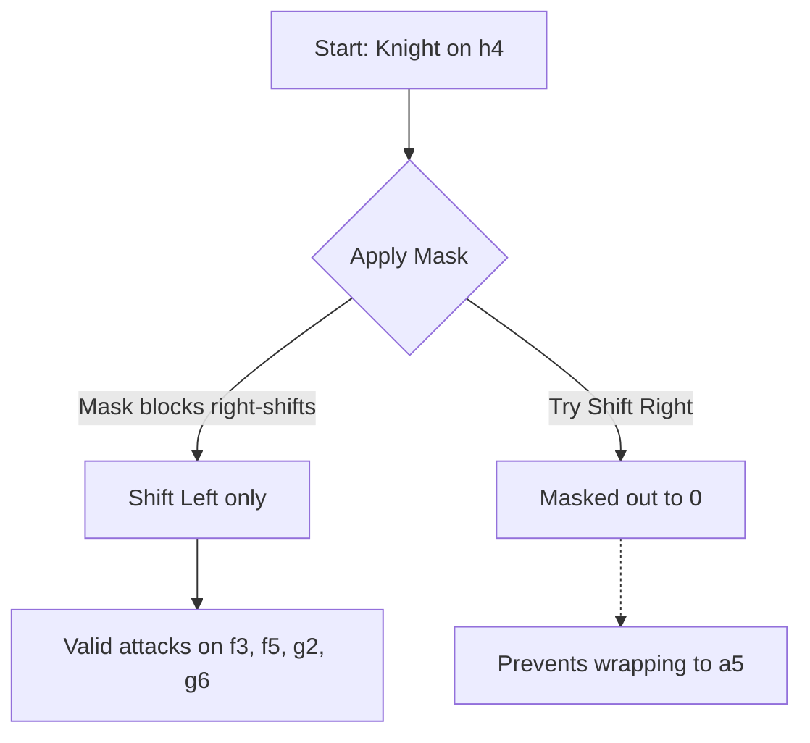

"Leaping" pieces (Knights and Kings) are unique: their attacks are never blocked by other pieces in between. A Knight on `e4` always attacks the same 8 squares, regardless of what pieces surround it.

Because of this property, we can completely eliminate move generation calculations for leapers during the search by calculating them **once at JVM startup**.

## The `O(1)` Array Lookup

When the engine boots, it populates two static arrays of size 64 (one index for each square on the board).

```scala
val knightAttacks: Array[Bitboard] = Array.tabulate(64)(computeKnightAttacks)
```

When the engine needs to find Knight moves, it simply reads from the precomputed array:

```scala
// Instant O(1) lookup during search:
val attacks = knightAttacks(Square.index(sq))
```

## The Wrap-Around Bug

When precomputing the attack tables using Bitboard shifts, we run into a classic chess programming problem: **Wrap-around bugs**.

Because a Bitboard is just a continuous 64-bit sequence (where square `a1` is bit 0, and `h8` is bit 63), shifting a Knight on the `H-file` (the right edge of the board) to the right will mathematically overflow into the `A-file` (the left edge) on the next rank!

To prevent this, we apply **Not-File Masks** before shifting.



### Example Mask (Not A-File)
If we want to shift a piece to the left (e.g. West), we first `AND` it with the `NotAFile` mask to ensure it's not already on the left edge. If it is on the A-file, the mask clears the bit, and the resulting shift becomes safely `0`.
```scala
val NotAFile: Bitboard = Bitboard(0xfefefefefefefefeL)

// Up 2, Left 1 (North-North-West)
val nnw = (knight & NotAFile) << 15 
```
