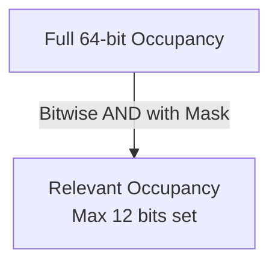
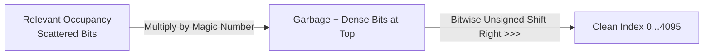

For leapers (Knights and Kings), move generation is simple because they jump over other pieces. We can precompute all possible attacks for all 64 squares (see [Leaper Attacks](/dicechess-engine-scala/architecture/move-generation/02-leapers/)). 

But for **sliding pieces** (Rooks, Bishops, and Queens), the situation is complex: their moves depend on the current state of the board. A rook's ray of attack stops when it hits another piece (a "blocker").

## The Problem with Raycasting

The traditional way to generate sliding moves is **Raycasting**: from the piece's square, step in a direction (e.g., North) one square at a time until you hit the edge of the board or another piece. 

While simple, raycasting is slow because it involves many loops and `if` statements (branching). In a highly optimized chess engine, we want to generate moves in $O(1)$ time — instantly, without loops.

## The Solution: Magic Bitboards

We want to precalculate attacks and store them in a lookup table. Ideally, we could just say:
`Attacks = LookupTable[Square][Occupancy]`

However, the `Occupancy` (where pieces are on the board) is a 64-bit number. A lookup table with $2^{64}$ entries would require 16 Exabytes of RAM! We need to compress this data. **Magic Bitboards** is a technique that achieves exactly this using perfect hashing.

### Step 1: Relevant Occupancy (Masking)

For any given square, a sliding piece only cares about a small subset of the board. 
Look at a Rook on `e4`. Does it care about a piece on `a8`? No. It only cares about pieces on the `e` file and the `4` rank.

Furthermore, **it doesn't care about pieces on the very edge of the board**. Why? Because whether the edge square is empty or occupied, the rook's attack will stop there anyway. 

By applying a "Mask", we extract only the **Relevant Occupancy**.
For a Rook, the maximum number of relevant squares is 12 (on `d4` for example). For a Bishop, it's 9. 



### Step 2: The Magic Hash

We now have a 64-bit number, but only up to 12 specific bits might be 1. All other bits are 0.
There are $2^{12} = 4096$ possible blocker combinations for a Rook on the worst-case square. We want an array of size 4096.

But how do we map our scattered 12 bits to a dense index from `0` to `4095`?
We use a **Magic Number** and a mathematical trick: multiplication.

When you multiply the Relevant Occupancy by a carefully chosen 64-bit Magic Number, the 12 scattered bits are shifted and added together, "magically" collecting at the very top (most significant bits) of the 64-bit result.

We then shift these bits back down to get our index:

```scala
val index = (RelevantOccupancy * MagicNumber) >>> (64 - 12)
```



### Where do Magic Numbers come from?

They are found via brute force! When starting the engine project, we write a script that generates random 64-bit numbers and tests them. If a number maps every possible blocker combination to a unique index without any collisions, we've found a "Magic Number" for that square! These numbers are hardcoded into the engine.

## The Final Lookup

Once the engine initializes, it precomputes all attacks using slow raycasting and saves them in arrays (`BishopTable` and `RookTable`). 

During the actual game search, finding a sliding attack takes just a few bitwise operations:

```scala
def rookAttacks(sq: Square, occupancy: Bitboard): Bitboard =
  val occ = occupancy & RookMasks(sq.index)
  val index = ((occ.value * RookMagics(sq.index)) >>> (64 - RookRelevantBits(sq.index))).toInt
  RookTable(RookOffsets(sq.index) + index)
```

This $O(1)$ lookup is what makes modern chess engines incredibly fast, allowing them to evaluate millions of positions per second. Queens simply combine the results of both Rook and Bishop lookups.
