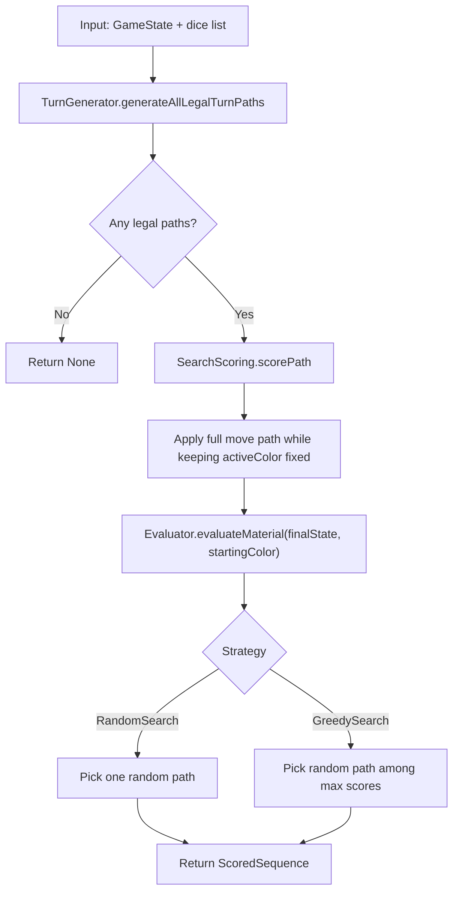
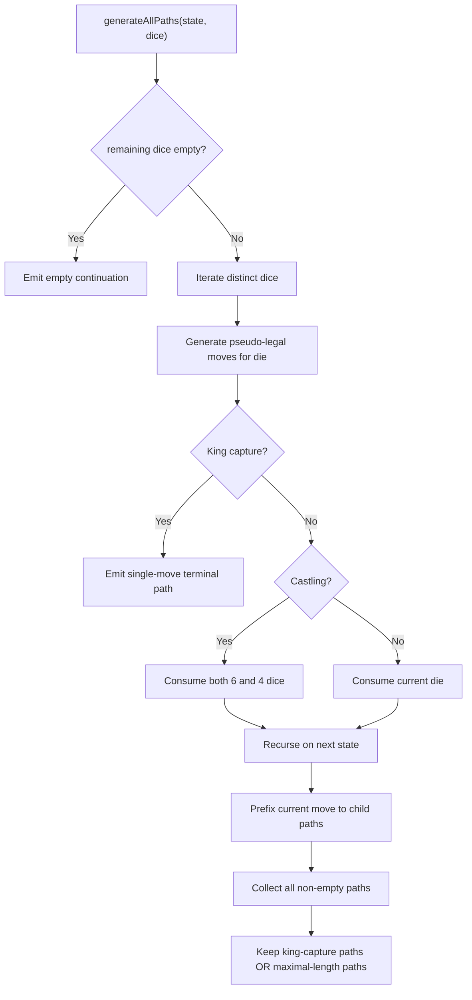
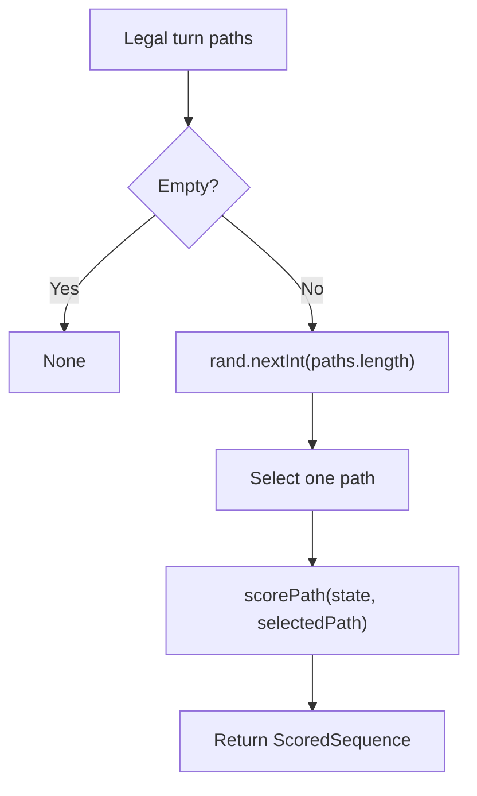
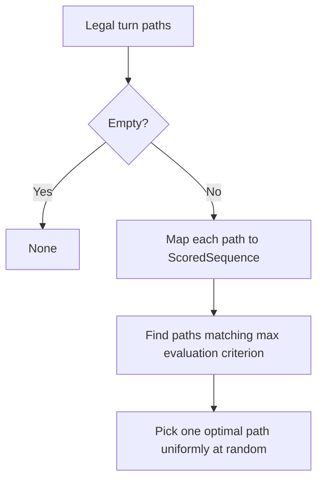

The current bot layer is intentionally small. It does not yet build a deep adversarial tree, estimate dice probabilities, or cache transpositions. Instead, it solves a narrower problem:

1. Enumerate every legal full-turn path for the rolled dice.
2. Score each resulting position from the active player's perspective.
3. Pick either a random legal path or the highest-scoring path.

This page documents the exact behavior implemented today in `shared/src/main/scala/dicechess/engine/search/`.

---

## Shared Search Pipeline

Both `RandomSearch` and `GreedySearch` use the same three-stage pipeline:



The important detail is that both algorithms reason about a **full Dice Chess turn**, not a single micro-move. A returned sequence may therefore contain one, two, or three moves depending on the rolled dice and the maximum micro-moves rule.

## Stage 1: Enumerating Legal Turn Paths

`TurnGenerator.generateAllLegalTurnPaths` is the backbone of both search strategies. It recursively explores the full move space induced by the rolled dice and then filters the result set using Dice Chess legality rules.

### What the generator expands

For a given `GameState` and dice multiset:

* each die value is mapped to pseudo-legal moves through `MoveGenerator.generateMoves`
* each chosen move consumes one die, except castling, which consumes both king (`6`) and rook (`4`)
* after every simulated micro-move, the engine restores the original `activeColor` so the same player continues the turn
* the recursion stops when there are no remaining dice, no further legal moves, or a king capture occurs

### What makes a path legal

After exploring all non-empty paths, the generator keeps only:

* paths that capture the opponent king at any final step
* or paths whose length matches the maximum achievable length among all generated paths

That is the same maximum-micro-moves rule documented in the move-generation section, but here the output is the **full path list**, ready for bot selection.



## Stage 2: Scoring a Full Turn

Once a path is chosen for scoring, `SearchScoring.scorePath` simulates the entire sequence and evaluates the final board.

### Path application semantics

The scorer folds over the move list:

```scala
val finalState = path.foldLeft(state)((s, m) => s.makeMove(m).copy(activeColor = s.activeColor))
```

This mirrors the turn generator: the active color stays constant throughout the path because the player is still inside the same Dice Chess turn.

### Evaluation & Terminal Scoring

Path scoring distinguishes **terminal wins** from standard positional/material evaluations:

1. **Terminal Win Check**: The scorer first checks if the path results in a king capture (meaning the last move captures the opponent's king). If it does, the path is immediately scored as a terminal win:
   $$
   \text{score} = \text{TerminalWinScore} = \text{Int.MaxValue}
   $$
2. **Material Evaluation**: If the path does not capture the king, the scorer simulates the entire sequence to get the final board state and computes the **material balance**:

* Pawn = `100`
* Knight = `300`
* Bishop = `300`
* Rook = `500`
* Queen = `900`
* King = `10000`

The score is measured from the starting side's perspective:
$$
\text{score} = \text{material(active side)} - \text{material(opponent)}
$$

This has an important practical consequence: both search strategies remain short-horizon and tactical, but the bot now explicitly prioritizes winning the game (capturing the opponent's king) over any material gain.

## RandomSearch

`RandomSearch` is the baseline strategy.

### Algorithm

1. Generate all legal full-turn paths.
2. Return `None` if the set is empty.
3. Choose one path uniformly at random.
4. Score that chosen path and return it as `ScoredSequence`.



### Why it exists

This strategy is useful as:

* a sanity-check baseline for the JavaScript API
* a non-deterministic bot for early UI testing
* a control group when evaluating whether smarter heuristics actually improve move quality

### Behavioral properties

* It never returns an illegal path because the randomness is applied **after** legality filtering.
* It may ignore clearly stronger captures because score is not used for selection.
* Two identical positions can produce different moves across runs.

## GreedySearch

`GreedySearch` keeps the same path generator and scorer, but changes the selection rule.

### Algorithm

1. Generate all legal full-turn paths.
2. Return `None` if the set is empty.
3. Score every candidate path using `SearchScoring.scorePath`.
4. Identify all optimal paths with the highest score, applying a **tie-breaker** for terminal wins: if multiple paths achieve `TerminalWinScore`, prefer the **shortest path** to win as quickly as possible.
5. If multiple paths share the exact same maximum evaluation criterion, choose one uniformly at random.



The tie-breaker is implemented as:
```scala
private def terminalWinPreference(scored: ScoredSequence): Int =
  if scored.score == SearchScoring.TerminalWinScore then -scored.moves.size else 0
```
This ensures that when a terminal win is possible in 1 move, the engine doesn't pick a 2- or 3-move sequence that also captures the king.

### What it optimizes

The algorithm is called "greedy" because it only optimizes the **immediate final material balance at the end of the current turn**. It does not search the opponent reply tree.

In practice, that means it tends to:

* prefer captures of high-value pieces
* prefer preparatory micro-moves if they unlock a stronger capture later in the same turn
* miss deferred tactical punishments that happen on the opponent turn

### Concrete example

The test suite contains a representative case:

* White rolls pawn (`1`) and bishop (`3`)
* the pawn on `d2` blocks the bishop on `c1`
* Black queen stands on `h6`

`GreedySearch` correctly prefers the two-step sequence:

1. `d2` -> `d3`
2. `c1` -> `h6`

The first move has no direct material gain. It is chosen only because the shared turn-path generator can see the entire turn and the greedy scorer evaluates the resulting final state after both micro-moves.

## Side-by-Side Comparison

| Aspect | RandomSearch | GreedySearch |
| :--- | :--- | :--- |
| Candidate generation | All legal full-turn paths | All legal full-turn paths |
| Selection rule | Uniform random pick | Random choice among highest-scoring optimal paths (prioritizes terminal wins & shortest win paths) |
| Determinism | No | No, selects randomly among top-evaluated paths |
| Uses evaluator for choice | No | Yes |
| Typical purpose | Baseline / UI smoke testing | Simple bot / immediate tactics |

## Current Limits

These algorithms are intentionally primitive and should be read as milestone-`v0.4` bot infrastructure, not as the planned final engine search.

Known limits:

* full-path enumeration happens eagerly before selection
* evaluation is material-only
* no opponent-response modeling
* no probability weighting for future dice outcomes
* no alpha-beta pruning, transposition table, or iterative deepening

Those concerns belong to the later Expectimax-focused milestones. The current design is still valuable because it validates three critical contracts early:

* full-turn legality under Dice Chess rules
* JavaScript-facing bot integration through `DiceChess.getBestMove`
* the ability to compare selection strategies over the same generated move space
