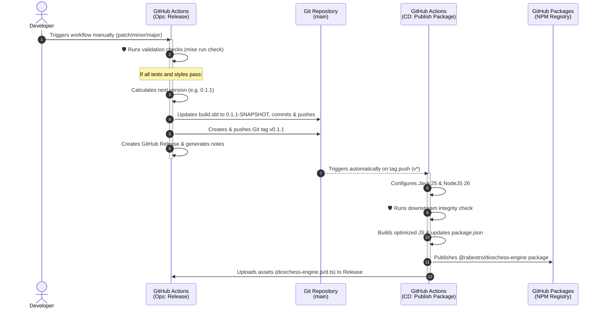

The Dice Chess Engine is a high-performance cross-platform library compiled for both the JVM and Scala.js (NPM). To ensure absolute stability and ease of deployment, the repository implements a highly automated **CI/CD and Release pipeline** split into three main workflows: **CI (Continuous Integration)**, **Ops (Release Automation)**, and **CD (Continuous Delivery)**.

---

## Release Pipeline Architecture

The release pipeline follows a robust **two-phase validation design**. The manual release initiation automatically bumps versions, commits project descriptors, tags the git history, and triggers downstream compiler optimizations and package distribution.

---

## Workflow Details

### 1. CI (Continuous Integration)
* **Trigger**: Automatically runs on every push to `main` and all Pull Requests targeting `main`.
* **Environment**: Runs on `ubuntu-latest` with Java `25` (Temurin) and SBT cached.
* **Responsibilities**:
  * Verifies code formatting with `sbt scalafmtCheckAll`.
  * Runs the test suite on JVM with code coverage enabled via `sbt clean coverage test coverageReport`.
  * Triggers a JetBrains Qodana code quality scan.
  * Conducts a SonarQube analysis to report code smells, vulnerabilities, and coverage metrics to SonarCloud.

### 2. Ops: Release
* **Trigger**: Manually triggered by maintainers via the GitHub Actions tab (`workflow_dispatch`).
* **Inputs**:
  * `bump`: Choose version increment type (`patch`, `minor`, `major`).
* **Responsibilities**:
  * **Safety Gate**: Installs Java 25 and Mise, and runs `mise run check` (compilation & tests). If any checks fail, the release is aborted *before* modifying Git history.
  * **Version Calculation**: Bumps the latest tag (e.g. `v0.1.0` ➡️ `v0.1.1` for a `patch` bump).
  * **Descriptor Sync**: Programmatically updates the `version` variable inside `build.sbt` to the new `-SNAPSHOT` format (e.g., `0.1.1-SNAPSHOT`).
  * **Commit & Tag**: Commits the updated `build.sbt` back to the repository and pushes to `main`, then pushes a new Git tag (e.g., `v0.1.1`) pointing to this commit.
  * **Release Creation**: Generates automated release notes based on commit history and creates the GitHub Release.

### 3. CD: Publish Package
* **Trigger**: Automatically runs when a tag matching the `v*` pattern is pushed.
* **Responsibilities**:
  * Clones the repository at the tagged commit.
  * Compiles and fully optimizes the Scala.js code (`sbt rootJS/fullOptJS`).
  * Runs the packaging task `mise run package:prepare` which creates the final NPM distribution directory, copies TypeScript type definitions (`dist/dicechess-engine.d.ts`), and writes the SemVer version in `package.json`.
  * Publishes the compiled package `@rabestro/dicechess-engine` to the GitHub Packages NPM registry.
  * Uploads the release assets (`dist/dicechess-engine.js` and `dist/dicechess-engine.d.ts`) directly into the existing GitHub Release created by the `Ops: Release` workflow.

---

## Developer Operations

### How to Initiate a Release

To release a new version of the Dice Chess Engine, follow these steps:

1. Navigate to the **Actions** tab of the `dicechess-engine-scala` repository.
2. Select the **Ops: Release** workflow from the sidebar on the left.
3. Click **Run workflow** on the right.
4. Select the branch (default `main`) and the **Version bump type**:
   * `patch` — bug fixes, minor internal enhancements (e.g. `0.1.0` ➡️ `0.1.1`).
   * `minor` — new features, non-breaking core updates (e.g. `0.1.0` ➡️ `0.2.0`).
   * `major` — major breaking changes or architectural overhauls (e.g. `0.1.0` ➡️ `1.0.0`).
5. Click **Run workflow**.

The pipeline will execute the automated validation gates and publish the release seamlessly.
