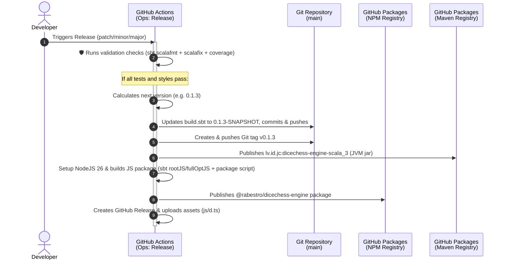

The Dice Chess Engine is a high-performance cross-platform library compiled for both the JVM and Scala.js. Every release delivers **two artifacts**: the NPM package `@rabestro/dicechess-engine` (Scala.js, for web consumers) and the Maven artifact `lv.id.jc:dicechess-engine-scala_3` (JVM, for backends such as `dicechess-analytics`). To ensure absolute stability and ease of deployment, the repository implements a highly automated **CI/CD and Release pipeline** split into two primary workflows: **CI (Continuous Integration)** and **Ops (Release Automation & Delivery)**.

---

## Release Pipeline Architecture

To bypass **GitHub's built-in security constraints** (which prevent tokens belonging to `github-actions[bot]` from triggering subsequent workflow runs), the entire release and package publishing cycle is combined into a single, **atomic manual pipeline**. This ensures the entire release process succeeds or fails as a single visual job run, preventing "partial releases" (e.g., when a git tag is pushed but the NPM package fail to publish).

---

## Workflow Details

### 1. CI (Continuous Integration)
* **Trigger**: Automatically runs on every push to `main` and all Pull Requests targeting `main`.
* **Environment**: Runs on `ubuntu-latest` with Java `25` (Temurin) and SBT cached.
* **Responsibilities**:
  * Verifies code formatting with `sbt scalafmtCheckAll`.
  * Runs the test suite on JVM with code coverage enabled via `sbt clean coverage test coverageReport`.
  * Triggers a JetBrains Qodana code quality scan.
  * Conducts a SonarQube analysis to report code smells, vulnerabilities, and coverage metrics to SonarCloud.

### 2. Ops: Release & Publish
* **Trigger**: Manually triggered by maintainers via the GitHub Actions tab (`workflow_dispatch`).
* **Inputs**:
  * `bump`: Choose version increment type (`patch`, `minor`, `major`).
* **Permissions**: Requires `contents: write` (to push commits, tags, and create releases) and `packages: write` (to publish NPM packages).
* **Responsibilities**:
  * **Safety Gate**: Installs Java 25 and SBT, then runs `sbt scalafmtCheckAll 'scalafixAll --check' clean coverage test coverageReport` (the same checks as `mise run check`, invoked directly so CI needs only the JVM toolchain). If any checks fail, the release is aborted *before* modifying Git history.
  * **Version Calculation**: Bumps the latest tag (e.g. `v0.1.2` ➡️ `v0.1.3` for a `patch` bump).
  * **Descriptor Sync**: Programmatically updates the `version` variable inside `build.sbt` to the new `-SNAPSHOT` format (e.g., `0.1.3-SNAPSHOT`).
  * **Commit & Tag**: Commits the updated `build.sbt` back to the repository and pushes to `main`, then pushes a new Git tag (e.g., `v0.1.3`) pointing to this commit.
  * **Maven Registry Publish**: Publishes the JVM artifact `lv.id.jc:dicechess-engine-scala_3` to the GitHub Packages Maven registry with the clean release version (the `-SNAPSHOT` suffix is overridden from the tag). See [Maven Artifact & JVM Integration](/dicechess-engine-scala/guidelines/maven-artifact/).
  * **NPM Compilation**: Sets up Node.js 26 and builds the optimized Scala.js JavaScript package and TypeScript declarations via `sbt rootJS/fullOptJS` followed by the `package/prepare` task script (run directly, no mise needed on the runner).
  * **NPM Registry Publish**: Publishes the package `@rabestro/dicechess-engine` to the GitHub Packages registry.
  * **Release Creation & Upload**: Creates the GitHub Release (generating release notes automatically) and uploads the generated `dicechess-engine.js` and `dicechess-engine.d.ts` directly as release assets.

---

## Developer Operations

### How to Initiate a Release

To release a new version of the Dice Chess Engine, follow these steps:

1. Navigate to the **Actions** tab of the `dicechess-engine-scala` repository.
2. Select the **Ops: Release** workflow from the sidebar on the left.
3. Click **Run workflow** on the right.
4. Select the branch (default `main`) and the **Version bump type**:
   * `patch` — bug fixes, minor internal enhancements (e.g. `0.1.0` ➡️ `0.1.1`).
   * `minor` — new features, non-breaking core updates (e.g. `0.1.0` ➡️ `0.2.0`).
   * `major` — major breaking changes or architectural overhauls (e.g. `0.1.0` ➡️ `1.0.0`).
5. Click **Run workflow**.

The pipeline will execute the automated validation gates, compile, publish to the registry, and create the release with assets in a single, robust visual run.
