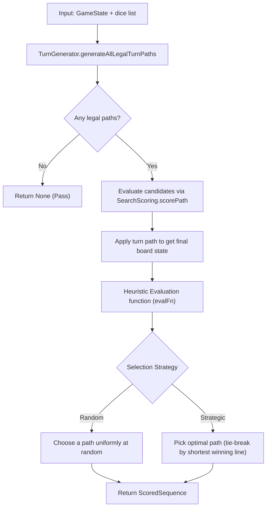

The engine's bot layer consists of five **single-turn (primitive) search algorithms** (Levels 1–5) and a non-primitive Monte-Carlo bot (Level 6). Unlike deep tree-search algorithms (like the upcoming Expectimax), the primitive bots do not search the opponent's reply tree. Instead, they solve a narrower tactical optimization problem:

1. Enumerate every legal full-turn path for the rolled dice using `TurnGenerator.generateAllLegalTurnPaths`.
2. Score each resulting position from the active player's perspective.
3. Select either a random legal path or the optimal path according to a specialized heuristic.

This page documents the exact behavior and equations for all bots implemented in `shared/src/main/scala/dicechess/engine/search/`.

---

## The Shared Evaluation Pipeline

All single-turn bots share the same core execution pipeline:

A critical property of Dice Chess is that these bots evaluate **full turn paths** (consisting of 1 to 3 micro-moves) as a single cohesive action, rather than evaluating individual micro-moves in isolation.

---

## Detailed Roster of Bot Strategies

### Level 1: Random Bot (`RandomSearch`)
* **Difficulty:** 1
* **Philosophy:** Completely blind to board state, representing pure chance.
* **Selection Logic:** Uniformly selects any legal turn path at random.
* **Purpose:** Acts as a baseline correctness check for move generation and a control group for benchmarking smarter bots.

---

### Level 2: Checkmate-Aware Bot (`CheckmateAwareSearch`)
* **Difficulty:** 2
* **Philosophy:** The first spark of tactical awareness. Cares *only* about the King (winning the game or surviving) and is completely blind to material values.
* **Selection Logic:**
  1. **Immediate Win:** Looks for any turn path that captures the opponent's King (`TerminalWinScore`). If one exists, it is selected immediately.
  2. **King Safety:** If no win is available, it filters paths to those where its own King is **not attacked** at the end of the turn:
     $$
     \text{Evaluator.evaluateKingSafety}(\text{finalState}, \text{myColor}) = 0
     $$
     It then selects a safe path randomly.
  3. **Fallback:** If all moves leave the King under attack, it falls back to selecting any legal path randomly.
* **Performance Optimization:** To minimize CPU overhead, it passes a dummy evaluator `(_, _) => 0` to `scorePath`, bypassing all material-counting calculations.

---

### Level 3: Greedy Bot (`GreedySearch`)
* **Difficulty:** 3
* **Philosophy:** Highly aggressive but short-sighted materialist.
* **Selection Logic:**
  - Evaluates all paths using **material balance** (`Evaluator.evaluateMaterial`).
  - Chooses the path that maximizes friendly material minus opponent material.
  - **Tie-Breaker:** If multiple paths win the game immediately, it prefers the **shortest path** to deliver checkmate as quickly as possible. Remaining ties are broken randomly.
* **Material Weights:**
  - Pawn = `100` | Knight/Bishop = `300` | Rook = `500` | Queen = `900` | King = `10000`

---

### Level 4: Cautious Greedy Bot (`GreedySearchV2`)
* **Difficulty:** 4
* **Philosophy:** Balances greed with self-preservation to avoid walking into immediate checkmates.
* **Selection Logic:**
  - Evaluates paths using both **material balance** and **King safety** (`Evaluator.evaluate`).
  - If a path leaves its own King under attack at the end of the turn, it applies a heavy **King Exposure Penalty** of `-2000` centipawns (greater than two Queens).
  - Selects the path maximizing the combined score:
    $$
    \text{Score} = \text{MaterialScore} + \text{KingSafetyScore}
    $$

---

### Level 5: Aggressive Bot (`AggressiveSearch`)
* **Difficulty:** 5
* **Philosophy:** Relentlessly hunts the opponent's King, pushes pawns forward, and coordinates its pieces around the enemy King's ring.
* **Selection Logic:**
  - Evaluates paths using a highly specialized attacking evaluation function (`Evaluator.evaluateAggressive`) that aggregates four distinct heuristics:
    $$
    \text{AggressiveScore} = \text{StandardScore} + \text{PawnStorm} + \text{KingProximity} + \text{KingRingPressure}
    $$

#### Algorithmic Heuristics under the Hood

1. **Pawn Storm Heuristic:**
   Encourages pawns to advance forward aggressively to open files and create attacking targets.
   * White pawns: `(rank - 2) * 15` centipawns.
   * Black pawns: `(7 - rank) * 15` centipawns.

2. **King Proximity Heuristic:**
   Measures the Chebyshev distance of active friendly pieces (Knights, Bishops, Rooks, Queens) to the enemy King's square $(EK_{\text{rank}}, EK_{\text{file}})$, rewarding pieces that cluster closer to the target.
   * Chebyshev distance: $\text{dist} = \max(|sq_{\text{rank}} - EK_{\text{rank}}|, |sq_{\text{file}} - EK_{\text{file}}|)$
   * Formula: $\sum (8 - \text{dist}) \times \text{weight}_{\text{piece}}$
   * Weights: Knight/Bishop = `15`, Rook = `25`, Queen = `40`.

3. **King Ring Pressure Heuristic:**
   Awards points for controlling the 8 squares immediately surrounding the enemy King (the "King Ring").
   * For each adjacent square, if a friendly piece attacks it (using `MoveGenerator.isSquareAttacked`), it receives `25` centipawns per attacking piece.

---

### Level 6: Monte-Carlo Bot (`MonteCarloSearch`)
* **Difficulty:** 6 (Beta)
* **Philosophy:** The first **non-primitive** bot — instead of a one-ply heuristic, it estimates the full-game win probability of each candidate turn with Rao-Blackwellized Monte-Carlo rollouts.
* **Selection Logic:**
  - For each legal turn, plays it and runs the [Monte-Carlo pre-roll equity estimator](/architecture/search/04-monte-carlo-equity/) on the resulting position, scoring the turn by the moving side's win probability (an immediate king capture short-circuits to the terminal win score).
  - Selects the highest-scoring turn; ties prefer the shorter king capture.
  - Doubling-cube decisions reuse the same Monte-Carlo estimate rather than the material sigmoid.
* **Cost:** per-move latency scales with `(legal turns) × (rollout budget)`, so it carries a configurable budget (`MonteCarloConfig`) and a modest default. Unlike the O(1) bots above, a statistically significant win-rate match is validated **offline** in the JVM Battle Arena (a default-budget match is far too slow for CI), and a JMH benchmark tracks per-move decision latency.

---

## Comparison of Primitive (O(1)) Bot Strategies

| Aspect | Level 1: Random | Level 2: Checkmate Aware | Level 3: Greedy | Level 4: Cautious Greedy | Level 5: Aggressive |
| :--- | :--- | :--- | :--- | :--- | :--- |
| **Material Aware** | No | No | Yes (Heuristic) | Yes (Heuristic) | Yes (Heuristic) |
| **King Safety Aware** | No | Yes (Binary Filter) | No | Yes (Exposure Penalty) | Yes (Exposure Penalty) |
| **Attacking Focus** | None | Direct King Capture | Loose captures | Loose captures | King hunt, Pawn Storm, Proximity |
| **Evaluator Used** | None | Dummy `(_, _) => 0` | `evaluateMaterial` | `evaluate` | `evaluateAggressive` |
| **Play Style** | Chaotic | Defensive & Evasive | Aggressive & Reckless | Balanced & Safe | Threatening & Pressuring |

---

### Empirical Strength & Win Rates (Battle Arena Benchmark)

To objectively evaluate the playing strength of these algorithms, we run simulations in the JVM Battle Arena. The benchmark plays **1,600 games per match** (800 games as White and 800 games as Black to eliminate color bias), using the **Greedy Bot** as the baseline. 

A draw is enforced by the **50-move rule** (100 half-moves without captures or pawn pushes) to prevent infinite loops.

The empirical results from a simulation match are as follows:

| Bot Strategy | Total Games | Wins (W/B) | Losses (W/B) | Draws (W/B) | Win Rate vs Greedy | Execution Time (1600 games) |
| :--- | :--- | :--- | :--- | :--- | :--- | :--- |
| **Level 1: Random** | 1,600 | 47 (19/28) | 1,553 (781/772) | 0 (0/0) | **2.9%** | ~4.83s |
| **Level 2: Checkmate Aware** | 1,600 | 661 (332/329) | 939 (468/471) | 0 (0/0) | **41.3%** | ~4.94s |
| **Level 3: Greedy (Baseline)** | 1,600 | 783 (385/398) | 817 (415/402) | 0 (0/0) | **48.9%** | **~3.53s** |
| **Level 4: Cautious Greedy** | 1,600 | 871 (428/443) | 729 (372/357) | 0 (0/0) | **54.4%** | ~3.93s |
| **Level 5: Aggressive** | 1,600 | 978 (499/479) | 622 (301/321) | 0 (0/0) | **61.1%** | ~4.53s |

#### Key Insights from the Benchmarks:
1. **Coordination Payoff:** The **Aggressive** bot reaches **61.1%**, proving the value of attacking heuristics (king proximity, pawn storm, king ring pressure).
2. **Eager Enumeration Cost:** All five primitive bots finish their 1,600-game match in under 5 seconds, confirming that single-turn O(1) heuristics are viable for real-time play.

---

## Computational Limitations of Single-Turn Search

While these bots perform well for instant matches, they illustrate the limits and challenges of single-turn architectures:
- **Shallow Horizon:** They evaluate the board only at the end of their own turn. They cannot foresee deep tactical lines.
- **Combinatorial Explosion:** Any attempt to evaluate the opponent's reply tree across all 216 rolls leads to massive execution delays without caching or pruning.
- **Eager Enumeration:** They eagerly generate and evaluate all possible legal paths, which becomes unsustainable beyond a depth of one full turn.

These limitations must be resolved via:
1. **Transposition Tables (TT) & Zobrist Hashing:** To cache evaluated states and prevent repeating calculations for transposition paths.
2. **Expectimax Search (Stage 3 / Difficulty 6+):** Traversing a deep tree of decision nodes and chance nodes using alpha-beta pruning (e.g. Star1/Star2) to limit node evaluation.
3. **Structured Concurrency:** Utilizing Virtual Threads (`Ox`) to parallelize tree expansion on multi-core servers.
