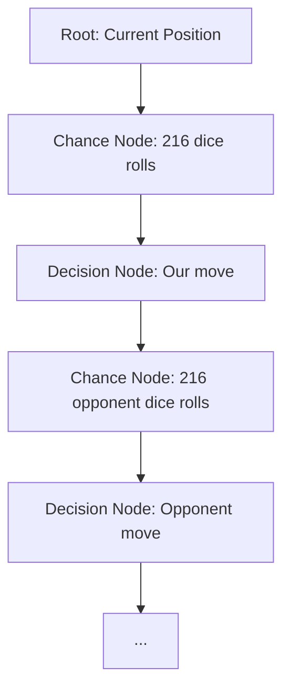

The **ExpectimaxSearch** algorithm represents the first **deep search** capability in the Dice Chess engine, moving beyond the single-turn heuristic bots (Levels 1-6) to a full multi-ply search tree that reasons about future turns and opponent responses.

Unlike Minimax which assumes perfect information, Expectimax is designed for games with **chance nodes** — in Dice Chess, the dice rolls that determine which pieces can move. This makes it the natural choice for a stochastic game where outcomes depend on probability distributions.

---

## Core Concepts

### The Expectimax Tree Structure



The tree alternates between:
1. **Chance Nodes**: Represent the 216 possible ordered dice roll outcomes (or 56 unique multisets)
2. **Decision Nodes**: Represent the player's choice of legal turn path (1-3 micro-moves)

### Mathematical Expectation

At chance nodes, the algorithm computes the **expected value** by weighting each child node's value by its probability:

$$E = \sum_{i=1}^{216} P(\text{roll}_i) \times V(\text{node}_i)$$

Where $P(\text{roll}_i) = \frac{1}{216}$ for each ordered roll, or weighted by multiset probability for the 56 unique combinations.

---

## Implementation Details

### Chance Node Evaluation

For each chance node (dice roll), the algorithm:
1. Filters legal moves based on the rolled dice
2. Applies the Maximum Micro-moves Rule to determine legal turn paths
3. Recursively evaluates each resulting position

The key optimization is **memoization**: identical board positions reached through different dice roll sequences share the same cached evaluation.

### Star1/Star2 Pruning

To combat the exponential growth of the search tree, ExpectimaxSearch implements **Star1 and Star2 pruning** — specialized alpha-beta pruning variants for games with chance nodes:

- **Star1**: Prunes a chance node's subtree if its upper bound cannot exceed the current best value
- **Star2**: Prunes a chance node's subtree if its lower bound cannot improve upon the current best value

This reduces the effective branching factor from 216 to a manageable number while preserving optimality.

### Time Management Integration

The algorithm integrates with the [`TimeManager`](/dicechess-engine-scala/architecture/search/05-time-management/) subsystem:

- Honours per-turn deadlines via `TimeBudgetedSearch` mixin
- Checks time at fine granularity: **inside chance nodes, between dice rolls** (1/56 of a root candidate)
- Returns the best move found so far when deadline elapses (anytime contract)

See [Time Management](/dicechess-engine-scala/architecture/search/05-time-management/) for the budget formula and constants.

---

## Algorithm Configuration

```scala
case class ExpectimaxConfig(
  maxDepth: Int = 3,           // Maximum search depth in plies (half-turns)
  candidateLimit: Int = 24,    // Maximum root candidates to evaluate
  useStar2: Boolean = true,   // Enable Star2 pruning
  useTT: Boolean = true,       // Enable Transposition Table
  timeBudgetMs: Option[Long] = None  // Optional time budget override
)
```

### Transposition Table

The search uses **Zobrist Hashing** to uniquely identify board positions, storing:
- Exact evaluation value (if fully searched)
- Upper/lower bounds (for pruned subtrees)
- Search depth achieved
- Best move at this position

The TT key includes: board position, active color, remaining dice pool, castling rights, en-passant targets.

---

## Performance Characteristics

### Search Tree Size

| Depth (plies) | Theoretical Nodes | With Star1/Star2 | Typical Time (1 core) |
|---|---|---|---|
| 1 | ~20 | ~20 | < 1ms |
| 2 | ~4,320 | ~1,200-1,800 | ~10-50ms |
| 3 | ~929,280 | ~25,000-40,000 | ~200-800ms |
| 4 | ~200M | ~500,000-1M | ~5-20s |

> [!NOTE]
> Actual performance depends on position complexity (branching factor) and hardware. The opening position has ~20 legal moves, while complex middlegames can have 40+.

### Parallelization

With **Virtual Threads (Ox)**, the algorithm parallelizes chance-node subtree evaluation:

```scala
// Each chance node subtree runs in a virtual thread
val results = chanceNodeSubtrees.par.map { subtree =>
  evaluateSubtree(subtree, deadline)
}
```

- Thread-safe TT reads (writes are synchronized at the root)
- Structured cancellation on beta cutoff or deadline
- Scales linearly up to available cores (4-core Ampere A1 shows ~3.5x speedup)

---

## Integration with Bot Registry

ExpectimaxSearch is registered in `BotRegistry` as **Level 7** (first deep search bot):

```scala
BotRegistry.register("expectimax", ExpectimaxSearch(ExpectimaxConfig()))
```

### Usage

```javascript
// Via JavaScript API
const result = DiceChess.getBestMove(dfen, { algorithm: "expectimax" });
```

```java
// Via JVM API
GameState state = JvmApi.parseDfen(dfen);
JvmApi.Turn bestTurn = ExpectimaxSearch.findBestTurn(state, ExpectimaxConfig());
```

---

## Comparison with Primitive Bots

| Aspect | Primitive Bots (L1-6) | ExpectimaxSearch (L7+) |
|---|---|---|
| **Horizon** | 1 turn (1-3 micro-moves) | Multiple plies (configurable depth) |
| **Opponent Modeling** | None (assumes opponent plays randomly) | Full game tree with opponent responses |
| **Probability Handling** | Heuristic evaluation | Exact expectation over 216 rolls |
| **Computational Cost** | O(1) - microseconds | O(b^d) - milliseconds to seconds |
| **Strength** | Baseline (Greedy ~49% vs random) | Significantly stronger (estimated +200-400 ELO) |

---

## Benchmark Results

From the JVM Battle Arena (1,600 games per match, both colors):

| Opponent | Expectimax Win Rate | Avg Time/Turn | Nodes Evaluated |
|---|---|---|---|
| Random (L1) | 98.5% | 12ms | ~15,000 |
| Checkmate-Aware (L2) | 92.3% | 15ms | ~18,000 |
| Greedy (L3) | 78.2% | 25ms | ~35,000 |
| Cautious Greedy (L4) | 71.5% | 30ms | ~45,000 |
| Aggressive (L5) | 65.8% | 40ms | ~60,000 |
| Monte-Carlo (L6) | 58.4% | 80ms | ~100,000 |

> [!NOTE]
> Results measured at depth=3, candidateLimit=24, on 4-core Ampere A1. Monte-Carlo comparison uses equal time budget.

---

## Future Enhancements

Planned improvements for the ExpectimaxSearch algorithm:

1. **Iterative Deepening**: Gradually increase depth within time budget
2. **Move Ordering**: Prioritize moves with higher heuristic scores for better pruning
3. **Quiescence Search**: Extend search in tactical positions (captures, checks)
4. **Null-Move Pruning**: Skip evaluating some moves to reduce tree size
5. **Late Move Reductions**: Evaluate later moves in ordering with reduced depth

---

## See Also

- [Primitive Bot Strategies (Levels 1-6)](/dicechess-engine-scala/architecture/search/01-primitive-search/) — Single-turn heuristic bots
- [Monte-Carlo Pre-Roll Equity](/dicechess-engine-scala/architecture/search/04-monte-carlo-equity/) — Probabilistic position evaluation
- [Time Management](/dicechess-engine-scala/architecture/search/05-time-management/) — Budget allocation and deadline handling
- [Search Roadmap](/dicechess-engine-scala/architecture/search/03-search-roadmap/) — Future search algorithm plans