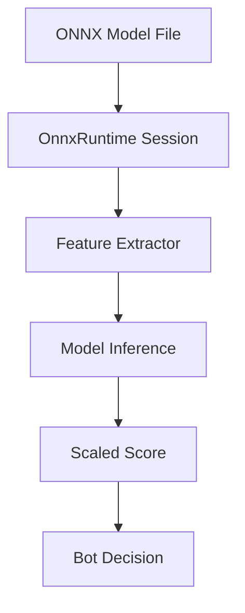

The Dice Chess engine supports **learned evaluation** via **ONNX (Open Neural Network Exchange)** models, enabling externally-trained value models to guide bot decision-making. This integration allows the engine to leverage machine learning models without embedding them in the codebase (models are passed as runtime files).

---

## Overview

ONNX integration provides two specialized bots:

1. **`OnnxEvalSearch`**: Uses ONNX model for leaf node evaluation in a shallow search
2. **`OnnxExpectimaxSearch`**: Combines ONNX evaluation with deep Expectimax search

Both bots are **JVM-only** (not available in JS/Wasm bundles due to ONNX Runtime dependency).

---

## Architecture



### Component Flow

1. **Model Loading**: ONNX model loaded via [ONNX Runtime Java API](https://github.com/microsoft/onnxruntime)
2. **Feature Extraction**: Board state converted to model input features via `OnnxFeatures`
3. **Inference**: Model evaluates position and returns win probability or score
4. **Integration**: Score combined with search algorithm's evaluation

---

## Feature Extraction

The engine implements multiple feature extractors in `shared/src/main/scala/dicechess/engine/search/`:

### 1. `OnnxFeatures` (Basic)

Extracts fundamental board state features:
- **Piece placement**: 6 piece types × 2 colors × 64 squares = 768 binary features
- **Active color**: 1 binary feature (0 = White, 1 = Black)
- **Castling rights**: 4 binary features (K, Q, k, q)
- **Dice pool**: 6 binary features (one per die value present)
- **Total**: 779 input features

### 2. `RichFeatures` (Extended)

Adds positional and material context:
- All `OnnxFeatures`
- **Piece-square tables**: Pre-computed positional values for each piece type
- **Material balance**: Count of each piece type per color
- **King safety**: Distance to enemy pieces, attacked squares around king
- **Total**: ~1,200 input features

### 3. `KcpFeatures` (King Capture Probability)

Specialized for king capture prediction:
- All `OnnxFeatures`
- **Attack maps**: Which squares are attacked by which piece types
- **King proximity**: Chebyshev distance from each piece to enemy king
- **Capture threats**: Immediate capture opportunities
- **Total**: ~1,500 input features

---

## Bot Implementations

### OnnxEvalSearch

A **single-turn bot** (Level 8) that uses ONNX model for position evaluation:

```scala
case class OnnxEvalConfig(
  modelPath: String,           // Path to .onnx model file
  featureExtractor: String = "rich",  // "basic", "rich", or "kcp"
  topK: Int = 10,             // Number of top candidates to evaluate with model
  fallbackAlgorithm: String = "aggressive"  // Fallback if model fails
)

val bot = OnnxEvalSearch(OnnxEvalConfig("/path/to/model.onnx"))
```

**Algorithm**:
1. Generate all legal turn paths
2. Score each with fast heuristic (material balance)
3. Select top-K candidates
4. Evaluate top-K with ONNX model
5. Return highest-scoring turn

**Performance**: ~10-50ms per move (depends on model complexity and topK)

### OnnxExpectimaxSearch

A **deep search bot** (Level 9) that combines ONNX evaluation with Expectimax:

```scala
case class OnnxExpectimaxConfig(
  modelPath: String,
  featureExtractor: String = "rich",
  expectimaxConfig: ExpectimaxConfig = ExpectimaxConfig(),
  useModelAtDepth: Int = 2   // Use model for leaf nodes at this depth
)

val bot = OnnxExpectimaxSearch(OnnxExpectimaxConfig("/path/to/model.onnx"))
```

**Algorithm**:
1. Perform Expectimax search to configured depth
2. At leaf nodes (or `useModelAtDepth`), use ONNX model instead of heuristic
3. Return best move from search

**Performance**: ~100-500ms per move (depth=3, model evaluation at leaves)

---

## Model Requirements

### Input Format

Models must accept input matching the selected feature extractor:

| Extractor | Input Shape | Input Type | Example Models |
|---|---|---|---|
| `basic` | `(1, 779)` | `float32` | Simple material evaluators |
| `rich` | `(1, ~1200)` | `float32` | Positional + material |
| `kcp` | `(1, ~1500)` | `float32` | King capture specialized |

### Output Format

Models must produce a single scalar output:
- **Shape**: `(1, 1)`
- **Type**: `float32`
- **Interpretation**: Win probability for the active color (0.0 to 1.0) or centipawn advantage

### Supported ONNX Opsets

- **Minimum**: opset 11 (LSTM, MatMul, Add, Mul, etc.)
- **Recommended**: opset 15+ for best compatibility
- **Verified**: Models exported from PyTorch, TensorFlow, scikit-learn (via ONNX converters)

---

## Usage Examples

### JVM Integration

```scala
import dicechess.engine.search.OnnxEvalSearch
import dicechess.engine.search.OnnxEvalConfig

// Load model and create bot
val config = OnnxEvalConfig(
  modelPath = "/models/dicechess_v1.onnx",
  featureExtractor = "rich"
)
val bot = OnnxEvalSearch(config)

// Use in game
val state = FenParser.parse(dfen).toOption.get
val bestTurn = bot.findBestTurn(state, List(1, 2, 3))  // With dice roll
```

### From Command Line (Arena)

```bash
# Run arena with ONNX bot vs baseline
sbt 'arena/runMain dicechess.engine.bench.BotMatchRunner \
  --base-bot onnx-eval \
  --opponent greedy \
  --games 100 \
  --onnx-model /path/to/model.onnx'
```

### With Custom Model

```bash
# Using OnnxExpectimaxSearch
sbt 'arena/runMain dicechess.engine.bench.OnnxArenaRunner \
  /path/to/model.onnx \
  aggressive \
  100'
```

---

## Training Guidelines

While model training is outside the engine's scope, here are recommendations for compatible models:

### Recommended Approach

1. **Features**: Use `RichFeatures` or `KcpFeatures` as input
2. **Target**: Train to predict win probability (0-1) or centipawn advantage
3. **Data**: Generate from bot-vs-bot games using `TurnGenerator`
4. **Framework**: PyTorch → ONNX export, or scikit-learn → ONNX

### Example Training Pipeline

```python
# Pseudocode for training
import onnx
import onnxruntime as ort
from sklearn.neural_network import MLPClassifier

# 1. Extract features from positions
features, targets = extract_game_data(dfen_list, results)

# 2. Train model (sklearn example)
model = MLPClassifier(hidden_layer_sizes=(256, 128, 64))
model.fit(features, targets)

# 3. Export to ONNX
initial_type = [('float_input', FloatTensorType([None, 1200]))]
onnx_model = convert_sklearn(model, initial_types=initial_type)
with open("dicechess_model.onnx", "wb") as f:
    f.write(onnx_model.SerializeToString())
```

### Feature Extraction in Python

Use the engine's `OnnxFeatures` as reference:

```python
# Equivalent Python feature extraction
def extract_features(board_state):
    features = []
    # Piece placement (768 features)
    for piece_type in [1, 2, 3, 4, 5, 6]:  # P, N, B, R, Q, K
        for color in [0, 1]:  # White, Black
            for square in range(64):
                features.append(1.0 if board[square] == (color, piece_type) else 0.0)
    # Active color (1 feature)
    features.append(1.0 if active_color == Black else 0.0)
    # Castling, dice pool, etc.
    return np.array(features, dtype=np.float32)
```

---

## Performance Considerations

### Inference Latency

| Model Complexity | Features | Inference Time | Throughput |
|---|---|---|---|
| Simple MLP (1 hidden layer) | 779 | ~0.1ms | ~10,000 evals/sec |
| MLP (2 hidden layers) | 1200 | ~0.3ms | ~3,000 evals/sec |
| MLP (3 hidden layers) | 1500 | ~0.8ms | ~1,200 evals/sec |
| Small CNN | 1200 | ~2ms | ~500 evals/sec |

> [!NOTE]
> Measured on 4-core Ampere A1 with ONNX Runtime 1.18+. JS/Wasm not supported.

### Memory Usage

- **Model in memory**: ~1-10MB (depends on model size)
- **ONNX Runtime overhead**: ~50MB
- **Session state**: ~1MB per concurrent session

---

## Dependency Management

ONNX integration requires:

```scala
// build.sbt
libraryDependencies += "com.microsoft.onnxruntime" % "onnxruntime" % "1.18.0"
```

The dependency is **JVM-only** and excluded from JS/Wasm compilation.

---

## Testing ONNX Integration

The engine includes a synthetic test model for validation:

```bash
# Test ONNX bot functionality
sbt "rootJVM/testOnly dicechess.engine.search.OnnxEvalSearchSpec"
```

Tests verify:
- Model loading from classpath
- Feature extraction correctness
- Score integration with search
- Fallback to heuristic on model failure

---

## Known Limitations

1. **JVM Only**: ONNX Runtime Java API not available for Scala.js/WebAssembly
2. **Model Size**: Large models (>50MB) may impact startup time
3. **Thread Safety**: ONNX Runtime sessions are thread-safe for inference but not for concurrent model loading
4. **Platform**: Requires Java 8+ (tested on Java 17+ and 25)

---

## See Also

- [Expectimax Search Engine](/dicechess-engine-scala/architecture/search/06-expectimax-search/) — Deep search with chance nodes
- [Bot Arena](/dicechess-engine-scala/architecture/search/03-search-roadmap/) — Testing bot strength
- [Primitive Bot Strategies](/dicechess-engine-scala/architecture/search/01-primitive-search/) — Heuristic-only bots for comparison
- [JVM API Reference](/dicechess-engine-scala/architecture/jvm-api/) — Java/Kotlin integration