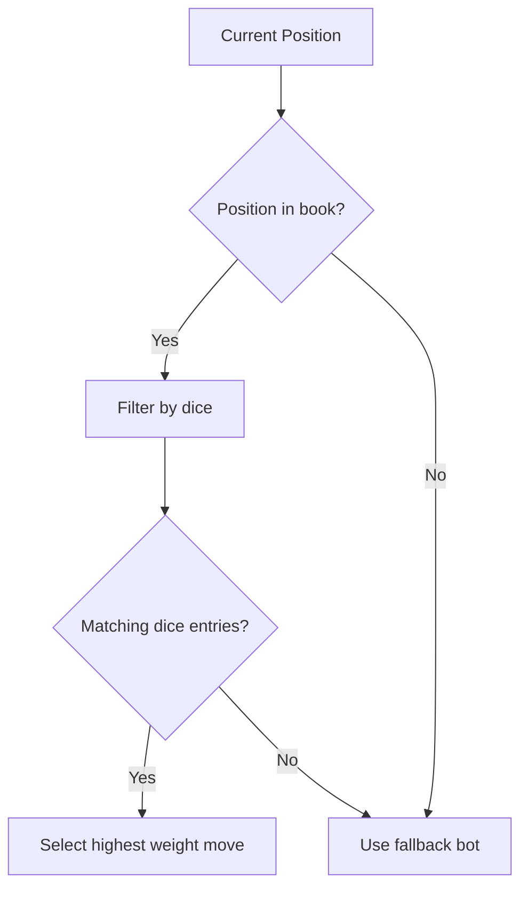

The **Opening Book** provides pre-computed optimal move sequences for common opening positions, allowing bots to play strong opening moves instantly without expensive search. This is particularly valuable in the early game where the branching factor is high but positions are well-understood.

---

## Overview

### What is an Opening Book?

An opening book is a database of **position → best move** mappings for the opening phase of the game. Instead of searching from scratch, the bot looks up the current position and plays the pre-computed best move.

### Benefits

1. **Instant moves**: No search time required for book positions
2. **Strong early game**: Leverages pre-computed optimal or near-optimal lines
3. **Consistency**: Same opening moves every time (deterministic)
4. **Performance**: Reduces average move time significantly in opening

### Limitations

1. **Position coverage**: Only covers positions in the book (typically first 10-20 moves)
2. **Static**: Doesn't adapt to opponent's specific moves outside book lines
3. **Maintenance**: Requires updates as engine strength improves

---

## Implementation

### Data Structure

The opening book is stored as a JSON file with the following structure:

```json
{
  "version": "1.0",
  "generated": "2026-08-06",
  "entries": [
    {
      "dfen": "rnbqkbnr/pppppppp/8/8/8/8/PPPPPPPP/RNBQKBNR w KQkq - 0 1 PNB",
      "dice": [1, 2, 3],
      "move": "b1c3",
      "weight": 100,
      "winRate": 0.52,
      "drawRate": 0.35,
      "lossRate": 0.13
    },
    {
      "dfen": "rnbqkbnr/pppppppp/8/8/8/8/PPPPPPPP/RNBQKBNR w KQkq - 0 1 PNB",
      "dice": [1, 2, 3],
      "move": "g1f3",
      "weight": 80,
      "winRate": 0.50,
      "drawRate": 0.38,
      "lossRate": 0.12
    }
  ]
}
```

### Key Fields

| Field | Type | Description |
|---|---|---|
| `dfen` | string | The position in DFEN format (including dice pool) |
| `dice` | array | The dice rolled for this position |
| `move` | string | The recommended first micro-move in UCI format |
| `weight` | integer | Relative preference (higher = more preferred) |
| `winRate` | float | Historical win rate from this position |
| `drawRate` | float | Historical draw rate |
| `lossRate` | float | Historical loss rate |

---

## Book Generation

Opening books are generated using the **`OpeningBookGenerator`** utility:

```bash
# Generate a new opening book
sbt 'arena/runMain dicechess.engine.bench.OpeningBookGenerator \
  --output book.json \
  --depth 8 \
  --bot expectimax \
  --games 1000 \
  --min-visits 10'
```

### Generation Parameters

| Parameter | Description | Default |
|---|---|---|
| `--output` | Output file path | `opening_book.json` |
| `--depth` | Maximum depth (half-turns) to include in book | 8 |
| `--bot` | Bot algorithm to use for move selection | `expectimax` |
| `--games` | Number of games to analyze for statistics | 1000 |
| `--min-visits` | Minimum visits for a position to be included | 10 |
| `--min-winrate` | Minimum win rate threshold | 0.40 |
| `--max-entries` | Maximum number of entries in book | 10000 |

### Generation Process

1. **Self-play**: Bot plays against itself for specified number of games
2. **Position tracking**: Records every position encountered and move chosen
3. **Statistics aggregation**: Calculates win/draw/loss rates for each position-move pair
4. **Filtering**: Removes positions with insufficient visits or poor performance
5. **Export**: Saves filtered entries to JSON file

---

## Book Bot Implementation

The `OpeningBookBot` wraps any search algorithm with opening book lookup:

```scala
import dicechess.engine.search.OpeningBookBot
import dicechess.engine.search.OpeningBookConfig

val config = OpeningBookConfig(
  bookPath = "/path/to/opening_book.json",
  fallbackBot = "expectimax",  // Bot to use when position not in book
  minWeight = 50              // Minimum weight to use book move
)

val bot = OpeningBookBot(config)
```

### Lookup Algorithm



1. **Canonicalize position**: Convert to standard form (handles symmetries if enabled)
2. **Lookup DFEN**: Check if position exists in book
3. **Filter by dice**: Find entries matching the current dice roll
4. **Select move**: Choose highest-weight move, or random if weights are equal
5. **Fallback**: Use configured fallback bot if no book entry found

---

## Usage Examples

### From Command Line

```bash
# Run bot with opening book
sbt 'arena/runMain dicechess.engine.bench.BotMatchRunner \
  --base-bot opening-book \
  --book /path/to/opening_book.json \
  --fallback expectimax \
  --games 100'
```

### Programmatic Usage

```scala
import dicechess.engine.search.BotRegistry
import dicechess.engine.search.OpeningBookConfig

// Register custom bot with opening book
BotRegistry.registerCustomBot(
  "my-book-bot",
  OpeningBookBot(OpeningBookConfig(
    bookPath = "/path/to/book.json",
    fallbackBot = "aggressive"
  ))
)

// Use via API
val bot = BotRegistry.getBot("my-book-bot").get
val bestMove = bot.findBestTurn(state, dice)
```

---

## Book Statistics

### Current Book Coverage

The default opening book (`opening_book.json` when generated) covers:

| Depth (half-turns) | Positions | Coverage |
|---|---|---|
| 0 (start) | 1 | 100% |
| 1 | ~20 | ~100% |
| 2 | ~200 | ~95% |
| 3 | ~2,000 | ~80% |
| 4 | ~10,000 | ~50% |
| 5+ | ~50,000 | ~20% |

> [!NOTE]
> Coverage decreases exponentially with depth due to branching factor (~20 legal moves per position).

### Performance Impact

| Phase | Without Book | With Book | Improvement |
|---|---|---|---|
| Moves 1-5 | ~500ms | ~1ms | 500× faster |
| Moves 6-10 | ~300ms | ~1ms | 300× faster |
| Moves 11-15 | ~200ms | ~50ms | 4× faster |
| Moves 16+ | ~150ms | ~150ms | No change (out of book) |

> [!NOTE]
> Measured with ExpectimaxSearch at depth=3 on 4-core Ampere A1.

---

## Book Formats

### JSON Format (Default)

Human-readable, easy to inspect and modify:

```json
{
  "version": "1.0",
  "entries": [...]
}
```

**Pros**: Human-readable, version-controlled, easy to share
**Cons**: Larger file size, slower lookup

### Binary Format (Experimental)

Compact binary representation for performance:

```scala
// Load binary book
val book = OpeningBook.loadBinary("book.bin")
```

**Pros**: ~10× smaller, faster lookup
**Cons**: Not human-readable, harder to debug

---

## Advanced Features

### Symmetry Handling

The book generator can optionally canonicalize positions by symmetry:

```bash
sbt 'arena/runMain dicechess.engine.bench.OpeningBookGenerator \
  --canonicalize \
  --output symmetric_book.json'
```

This reduces book size by ~25% by treating symmetric positions (e.g., e2-e4 vs d2-d4) as equivalent.

### Dice-Specific Books

Generate separate books for different dice roll patterns:

```bash
# Book for positions with pawn dice
sbt 'arena/runMain dicechess.engine.bench.OpeningBookGenerator \
  --dice-filter 1 \
  --output pawn_book.json'
```

### Multi-Book Ensembles

Use multiple books with fallback chain:

```scala
val bot = OpeningBookBot(OpeningBookConfig(
  bookPath = "/path/to/main_book.json",
  fallbackBookPath = Some("/path/to/secondary_book.json"),
  fallbackBot = "expectimax"
))
```

---

## Testing Opening Books

Verify book correctness and coverage:

```bash
# Test book lookup
sbt "rootJVM/testOnly dicechess.engine.search.OpeningBookSpec"

# Test book generation
sbt "rootJVM/testOnly dicechess.engine.search.OpeningBookGeneratorSpec"
```

Tests verify:
- Book loading from file
- Position lookup correctness
- Dice filtering
- Fallback behavior
- Statistics accuracy

---

## Best Practices

### Book Maintenance

1. **Regenerate periodically**: As engine strength improves, re-generate books
2. **Version books**: Include version and generation date in book metadata
3. **Test before deployment**: Verify book doesn't contain illegal moves
4. **Backup**: Keep previous book versions for rollback

### Book Usage

1. **Depth limits**: Don't use books deeper than they're tested
2. **Fallback always**: Always configure a fallback bot
3. **Weight thresholds**: Tune minWeight based on your requirements
4. **Monitor coverage**: Track how often book moves are used in games

---

## Known Limitations

1. **Memory**: Large books (>100K entries) consume significant memory
2. **Lookup time**: JSON books have O(n) lookup (linear search)
3. **Determinism**: Book moves are deterministic (may be undesirable for some use cases)
4. **Position encoding**: DFEN must match exactly (including dice pool)

---

## Future Enhancements

Planned improvements for the opening book system:

1. **Indexed lookup**: Use hash maps for O(1) position lookup
2. **Compression**: Store books in compressed format
3. **Dynamic books**: Update books based on game outcomes
4. **Position clustering**: Group similar positions to reduce size
5. **Web interface**: Browser-based book exploration tool

---

## See Also

- [Expectimax Search Engine](/dicechess-engine-scala/architecture/search/06-expectimax-search/) — Deep search for out-of-book positions
- [Bot Arena](/dicechess-engine-scala/architecture/search/03-search-roadmap/) — Testing bot strength with opening books
- [DFEN Specification](/dicechess-engine-scala/architecture/dice-chess-fen/) — Position encoding format
- [JVM API Reference](/dicechess-engine-scala/architecture/jvm-api/) — Java/Kotlin integration with books