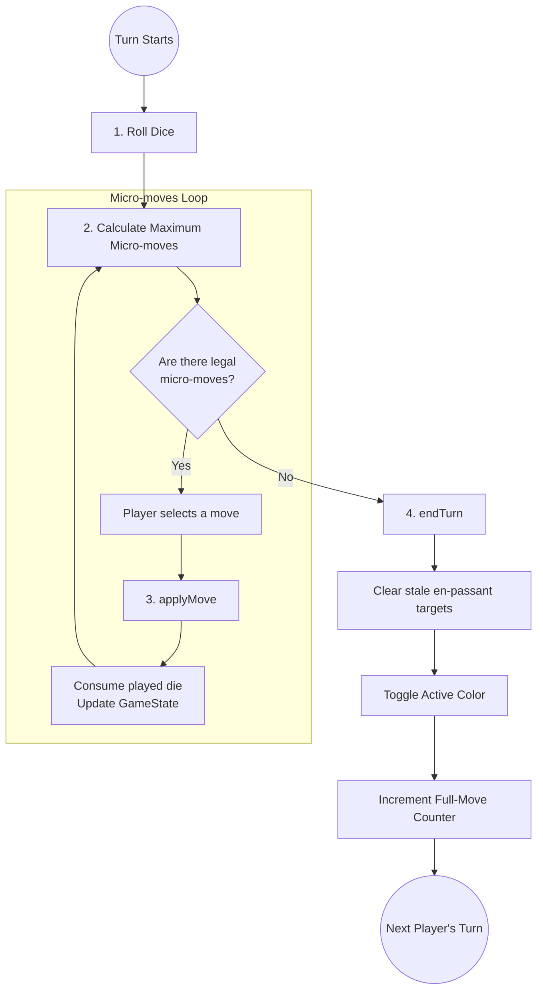

Unlike standard chess where a turn is a single, atomic action (moving one piece), a **Dice Chess** turn is an extended sequence with multiple distinct phases. This architectural choice is driven by the physical rules of the game (rolling three dice and playing up to three micro-moves).

This document outlines the conceptual lifecycle of a turn and how it maps to the Engine API and internal `GameState`.

## The Turn Lifecycle Diagram

## 1. Roll Dice (Start of Turn)

At the beginning of a turn, the active player rolls three standard 6-sided dice. 
In the engine, this translates to populating the `dicePool` array within the `GameFlags` object.

* **DFEN Representation**: If White rolls three pawns, the 7th field of the DFEN string becomes `PPP`.
* **API Entry**: In the Javascript API, the available dice are passed as an array to functions like `getLegalUciMoves(fen, [1, 1, 1])`.

## 2. Generate and Filter Legal Moves

With the dice rolled, the engine calculates all pseudo-legal moves for the pieces matching the dice outcomes.
Crucially, the engine then applies the **Maximum Micro-moves Rule** (see [Maximum Micro-moves Rule Algorithm](./move-generation/05-maximum-micromoves)).

Any path that does not consume the maximum possible number of dice (or capture the King) is aggressively filtered out. The player is presented with a strictly legal subset of first micro-moves.

## 3. The Micro-moves Loop (`applyMove`)

A player executes their turn incrementally.
Each time they make a move, the engine performs a **micro-move**:

* It updates the piece placements (using Bitboards and the Mailbox).
* It updates castling rights or adds a new *en-passant* target if a pawn was double-pushed.
* It removes the corresponding die from the active `dicePool`.

> [!WARNING]  
> **Color Preservation:** During `applyMove`, the active color **does not change**. If White plays their first micro-move, the resulting state still belongs to White.

## 4. Formal Turn Completion (`endTurn`)

Once the player has exhausted their available dice (or hit a state where no further legal micro-moves are possible), the turn must be explicitly terminated.

The orchestrator (e.g., the PWA frontend or the Search Bot) must invoke `DiceChess.endTurn(fen)`. 
This function is responsible for the critical **state transition boundary**:

1. **Active Color Toggle**: The active color switches to the opponent (e.g., White $\rightarrow$ Black).
2. **Move Counter**: The `fullMoveNumber` increments if the completing player was Black.
3. **Stale En-Passant Cleanup**: This is uniquely vital in Dice Chess. Since a player can push multiple pawns in one turn, multiple en-passant targets can exist. When the player *ends* their turn, any en-passant targets they created *on their previous turn* (which the opponent had a chance to capture but didn't) are wiped out. The targets they just created in *this* turn are preserved for the opponent's upcoming turn.
