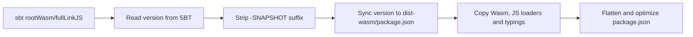

The Dice Chess Engine is a **cross-platform library** compiled for both the JVM and JavaScript targets via **Scala.js**. To accommodate different client environments and performance requirements, the engine is compiled and published as two separate NPM packages:

1. **[`@rabestro/dicechess-engine`](https://github.com/rabestro/dicechess-engine-scala/pkgs/npm/dicechess-engine)** — A pure JavaScript build (ES Module) optimized for synchronous execution.
2. **[`@rabestro/dicechess-engine-wasm`](https://github.com/rabestro/dicechess-engine-scala/pkgs/npm/dicechess-engine-wasm)** — A WebAssembly (Wasm) build featuring full support for computation-heavy search workloads.

JVM backends consume the engine via the [Maven artifact](/dicechess-engine-scala/guidelines/maven-artifact/) instead.

---

## Package Comparison & Guidelines

To select the most appropriate package for your application, consult the comparison table and recommendations below.

### Comparison Table

| Attribute | Pure JS (`@rabestro/dicechess-engine`) | WebAssembly (`@rabestro/dicechess-engine-wasm`) |
| :--- | :--- | :--- |
| **Compiled Files** | `dicechess-engine.js`, `dicechess-engine.d.ts` | `main.js`, `main.wasm`, `__loader.js`, `dicechess-engine.d.ts` |
| **Download Size** | **1.37 MB** (uncompressed) | **~487 KB** total (472 KB `.wasm`) |
| **Initialization** | Synchronous (immediate import) | Asynchronous (loads `.wasm` via top-level await) |
| **Move Gen Speed** | Standard (e.g. 5,000 iterations: **112 ms**) | Fast (e.g. 5,000 iterations: **85 ms** / **1.3x speedup**) |
| **Monte-Carlo Speed** | Standard (e.g. 10 rollouts: **7.38 s**) | Blazing Fast (e.g. 10 rollouts: **2.87 s** / **2.6x speedup**) |

### When to use which package?

* **Use `@rabestro/dicechess-engine` (Pure JS)** for synchronous operations in the main browser thread. This includes real-time UI move validation (`applyMove`, `getLegalUciMoves`), board rendering, and simple turn transitions. It loads instantly and avoids asynchronous loader boilerplate or bundler configuration issues with `.wasm` binaries.
* **Use `@rabestro/dicechess-engine-wasm` (Wasm)** in a background Web Worker for heavy computations. This includes Expectimax bot search (`getBestMove`) and Rao-Blackwellized Monte-Carlo equity simulations (`estimateEquity`).

> [!NOTE]
> The performance speedup for WebAssembly is significantly higher for heavy workloads (like Monte-Carlo simulation) because the calculation takes place entirely inside the Wasm memory space. For fast calls like move generation, the overhead of crossing the JavaScript-to-Wasm boundary (marshaling strings and arrays) consumes a large portion of the performance gains.

---

## Packaging Lifecycle Tasks

Three `mise` tasks manage the packaging and distribution lifecycle:

| Task | Description |
| :--- | :--- |
| `mise run package:prepare` | Build optimized pure JavaScript package and assemble the `dist/` directory |
| `mise run package:prepare-wasm` | Build optimized WebAssembly package and assemble the `dist-wasm/` directory |
| `mise run package:clean` | Remove both the `dist/` and `dist-wasm/` directories |

---

## What `package:prepare-wasm` Does

Similar to the pure JS packaging script, `.mise/tasks/package/prepare-wasm` packages the Scala.js WebAssembly target for distribution:



1. **Compiles Wasm Target** — Depends on `wasm:build`, which runs `sbt rootWasm/fullLinkJS` to compile Scala.js to WebAssembly. This generates the `main.wasm` bytecode, a `main.js` ES Module wrapper, and the `__loader.js` loader module.
2. **Synchronizes versioning** — Syncs the NPM package version to match the current SBT version (minus `-SNAPSHOT`).
3. **Flattens the output structure** — Copies the Wasm binary and supporting files into a clean `dist-wasm/` directory.
4. **Optimizes package configuration** — Adjusts paths in `dist-wasm/package.json` to flat-level references so the module exports are correctly resolved when published.

---

## Downstream WebAssembly Integration Guide

Because bundlers (like Vite) struggle to resolve `.wasm` files dynamically loaded inside Web Workers when shipped inside `node_modules`, downstream frontends (like SvelteKit) should follow this integration pattern:

### 1. Copy Wasm Assets as Static Files
Create a pre-build script (e.g. `scripts/copy-wasm.mjs`) to copy the engine's Wasm runtime into a static asset directory:

```javascript
// scripts/copy-wasm.mjs
import { mkdir, copyFile } from 'node:fs/promises';
import { dirname, join } from 'node:path';
import { fileURLToPath } from 'node:url';

const root = dirname(dirname(fileURLToPath(import.meta.url)));
const src = join(root, 'node_modules', '@rabestro', 'dicechess-engine-wasm');
const dest = join(root, 'public', 'engine-wasm');
const files = ['main.js', 'main.wasm', 'main.wasm.map', '__loader.js'];

await mkdir(dest, { recursive: true });
for (const file of files) {
  await copyFile(join(src, file), join(dest, file));
}
console.log(`Copied ${files.length} engine WASM files to public/engine-wasm/`);
```

### 2. Dynamically Import Wasm inside Web Worker
Scala.js Wasm uses top-level await to compile. Load the engine dynamically inside the Worker thread so it doesn't block worker initialization or drop incoming messages:

```javascript
// public/mc-worker.js
let enginePromise;
const loadEngine = () => (enginePromise ??= import(`${location.origin}/engine-wasm/main.js`));

self.onmessage = async (event) => {
  if (event.data.type === 'start') {
    const engine = await loadEngine();
    // Run CPU-intensive Monte-Carlo equity estimation
    const result = engine.estimateEquity(event.data.dfen, { rollouts: 100 });
    self.postMessage({ type: 'result', data: result });
  }
};
```

---

## Local Integration Testing

To test engine changes in a downstream project (e.g. `dicechess-analytics-ui`) **before** publishing a release:

```bash
# 1. Build local packages in dicechess-engine-scala
mise run package:prepare
mise run package:prepare-wasm

# 2. Link to local builds in your frontend project
cd ../dicechess-analytics-ui
npm link ../dicechess-engine-scala/dist
npm link ../dicechess-engine-scala/dist-wasm

# 3. Run frontend development server
npm run dev
```

:::tip
After linking, the frontend's imports resolve to your local `dist/` or `dist-wasm/` folders. Any changes you make to the engine and re-compile are immediately reflected.
:::

### Unlinking

To revert to the published registry versions:

```bash
cd ../dicechess-analytics-ui
npm unlink @rabestro/dicechess-engine
npm unlink @rabestro/dicechess-engine-wasm
npm install
```
