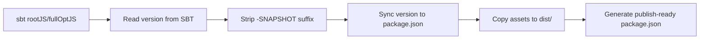

The Dice Chess Engine is a **cross-platform library** compiled for both the JVM and **Scala.js**.
The Scala.js output is published as the [`@rabestro/dicechess-engine`](https://github.com/rabestro/dicechess-engine-scala/pkgs/npm/dicechess-engine) NPM package to the GitHub Package Registry and consumed by web frontends — primarily [dicechess-analytics-ui](https://github.com/rabestro/dicechess-analytics-ui) (the frozen [dicechess-lab](https://github.com/rabestro/dicechess-lab) was the original consumer). JVM backends consume the engine via the [Maven artifact](/dicechess-engine-scala/guidelines/maven-artifact/) instead.

Two `mise` tasks manage the packaging lifecycle:

| Task | Description |
| :--- | :--- |
| `mise run package:prepare` | Build optimized JavaScript and assemble the `dist/` directory for publishing |
| `mise run package:clean` | Remove the `dist/` directory |

---

## What `package:prepare` Does

The task bridges the gap between **SBT** (Scala build) and **NPM** (JavaScript ecosystem) by flattening the build output into a clean, publishable directory.

### Step-by-step breakdown



1. **Compiles Scala.js** — the task depends on `js:build`, which runs `sbt rootJS/fullOptJS`
   to produce an optimized JavaScript bundle.

2. **Synchronizes versioning** — reads the current project version from `build.sbt`
   (e.g. `0.1.3-SNAPSHOT`), strips the `-SNAPSHOT` suffix, and writes the clean
   semantic version back to `package.json`.

3. **Flattens the output structure** — copies the essential files into a clean `dist/` directory:

   | Source | Destination |
   | :--- | :--- |
   | `js/target/scala-3.x.x/dicechess-engine-scala-opt/main.js` | `dist/dicechess-engine.js` |
   | `js/dicechess-engine.d.ts` | `dist/dicechess-engine.d.ts` |
   | `js/README.md` | `dist/README.md` |

4. **Builds a publish-ready `package.json`** — uses `jq` to transform the root
   `package.json` into a stripped-down version inside `dist/`:
   - Sets `main` to `"dicechess-engine.js"` (flat path, no `dist/` prefix).
   - Sets `types` to `"dicechess-engine.d.ts"`.
   - Removes the `files` array (unnecessary since `npm publish ./dist` publishes
     the directory contents directly).

---

## Why This Lives in a Task Script (Not in GitHub Actions YAML)

The packaging logic is intentionally kept in a dedicated task script
(`.mise/tasks/package/prepare`) rather than spread across CI workflow YAML.
This follows the **Local-First CI** principle:

### Local debugging
If the packaging script breaks (e.g., a Scala.js output path changes after
a compiler upgrade), you can run `mise run package:prepare` locally to diagnose
and fix it instantly — instead of pushing speculative commits to trigger remote
CI runs.

### Cross-project testing
You can build the package locally and link it into a frontend without
publishing a release to the registry. This is essential for testing engine
changes end-to-end before committing to a release.

### Single source of truth
The packaging steps live in **one script**. Locally you invoke it through mise,
which also runs its `js:build` dependency for you:

```bash
mise run package:prepare
```

CI runs the **same script** directly — without mise, so the release/publish jobs
only need the JVM toolchain from `setup-java`/`setup-sbt` (and `jq`, which is
preinstalled on GitHub runners). The `js:build` dependency is run explicitly:

```yaml
- name: Build JavaScript package
  run: |
    sbt rootJS/fullOptJS
    bash .mise/tasks/package/prepare

- name: Publish to GitHub Package Registry
  run: npm publish ./dist
```

If the packaging steps ever need to change, you update **one place** (the script)
and both the local task and CI pick up the change.

---

## Local Integration Testing with dicechess-lab

To test engine changes in the frontend **before** publishing a release:

```bash
# 1. In dicechess-engine-scala: build the local package
mise run package:prepare

# 2. In dicechess-lab/frontend-pwa: link to the local build
cd ../dicechess-lab/frontend-pwa
npm link ../../dicechess-engine-scala/dist

# 3. Start the frontend dev server — it now uses your local engine
mise run frontend
```

:::tip
After linking, the frontend's `import { DiceChess } from '@rabestro/dicechess-engine'`
resolves to your local `dist/dicechess-engine.js` instead of the published registry
version. Any changes you make to the engine and re-build with `mise run package:prepare`
are immediately reflected.
:::

### Unlinking

To revert to the published registry version:

```bash
cd ../dicechess-lab/frontend-pwa
npm unlink @rabestro/dicechess-engine
npm install
```
